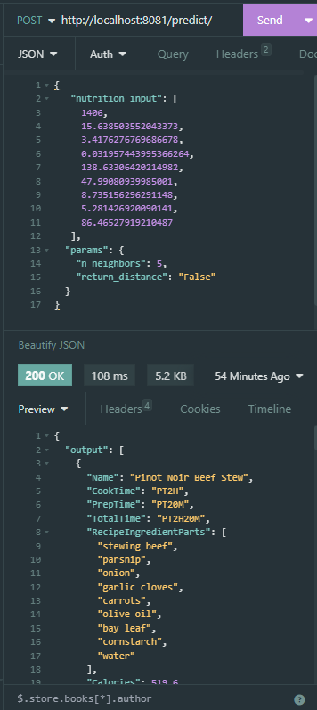

# Diet-Recommendation-System
A simple diet recommender system that uses Docker to manage the application's backend and frontend.

Calorie Calculator based on [this](https://mohap.gov.ae/en/more/awareness-center/calories-calculation).

## Requirements:
- Download and install both [Docker Desktop and Docker Compose](https://docs.docker.com/compose/install/).

## Tools and Technologies
- Docker
- Python
- FastAPI 
- Uvicorn
- ReactJS

## How to run both backend and frontend
Clone repository
```
git clone https://github.com/Aibi-Green/Diet-Recommendation-System.git
```

Run docker-compose in terminal of your project root:
```
docker-compose up -d --build
```

After building the docker containers, open Web App with this link: [http://localhost:5173](http://localhost:5173)

## Backend Testing
Download and Install an API platform such as [Insomnia](https://insomnia.rest/download) or [Postman](https://www.postman.com/downloads/).

Then, create an HTTP request (GET or POST).



## Resources
Dataset - [Kaggle](https://www.kaggle.com/datasets/irkaal/foodcom-recipes-and-reviews?select=recipes.csv)